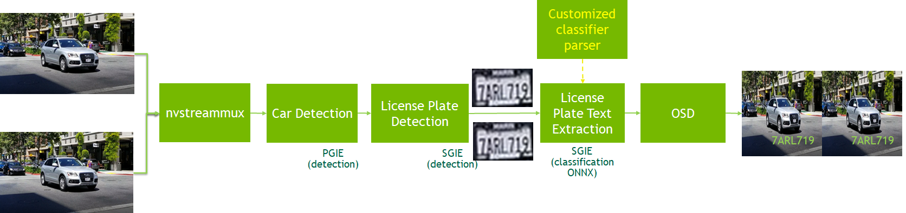

# Sample For Car License Recognization

 - [Description](#description)
 - [Prerequisition](#prerequisition)
 - [Download](#Prepare-Models-and-TensorRT-engine)
 - [Build Parser](#Build-custom-parser)
 - [Run](#Run-app)

---

## Description

This sample is to show how to use graded models for detection and classification with DeepStream SDK version not less than 5.0.1. The models in this sample are all TLT3.0 models. Image is written to a folder when the license plate crosses a virtual line. The line crossing is achieved by using the NVAnalytics module of Deepstream python (https://github.com/NVIDIA-AI-IOT/deepstream_python_apps).

`PGIE(car detection) -> SGIE(car license plate detection) -> SGIE(car license plate recognization)`



This pipeline is based on three TLT models below

* Car detection model https://ngc.nvidia.com/catalog/models/nvidia:tlt_trafficcamnet
* LPD (car license plate detection) model https://ngc.nvidia.com/catalog/models/nvidia:tlt_lpdnet
* LPR (car license plate recognization/text extraction) model https://ngc.nvidia.com/catalog/models/nvidia:tlt_lprnet

More details for TLT3.0 LPD and LPR models and TLT training, please refer to [TLT document](https://docs.nvidia.com/metropolis/TLT/tlt-getting-started-guide/).

## Prerequisition

* [DeepStream SDK 5.1](https://developer.nvidia.com/deepstream-getting-started)

  Make sure deepstream-test1 sample can run successful to verify your DeepStream installation


## Prepare Models and TensorRT engine

Download repo:
```
    git clone https://github.com/preronamajumder/deepstream_apps.git
```
Download models:
```
    cd deepstream_lpr_python_app
    //for us car plate
    ./download_us.sh
    //for chinese car plate
    ./download_ch.sh
```
Download tlt-converter:

Download x86 or Jetson tlt-converter which is compatible to your platform from the following links inside the folder.

| Platform   |  Compute                       |        Link                                              |
|------------|--------------------------------|----------------------------------------------------------|
|x86 + GPU   |CUDA 10.2/cuDNN 8.0/TensorRT 7.1|[link](https://developer.nvidia.com/cuda102-cudnn80-trt71)|
|x86 + GPU   |CUDA 10.2/cuDNN 8.0/TensorRT 7.2|[link](https://developer.nvidia.com/cuda102-cudnn80-trt72)|
|x86 + GPU   |CUDA 11.0/cuDNN 8.0/TensorRT 7.1|[link](https://developer.nvidia.com/cuda110-cudnn80-trt71)|
|x86 + GPU   |CUDA 11.0/cuDNN 8.0/TensorRT 7.2|[link](https://developer.nvidia.com/cuda110-cudnn80-trt72)|
|Jetson      |JetPack 4.4                     |[link](https://developer.nvidia.com/cuda102-trt71-jp44)   |
|Jetson      |JetPack 4.5                     |[link](https://developer.nvidia.com/cuda102-trt71-jp45)   |

```
    wget <url>
    unzip <filename>
```
Convert LPR Model:  
DS5.0.1 gst-nvinfer cannot generate TRT engine for LPR model, so generate it with tlt-converter

```
    cd <foldername>
    chmod +x tlt-converter
    ./tlt-converter -k nvidia_tlt -p image_input,1x3x48x96,4x3x48x96,16x3x48x96 \
           ../models/LP/LPR/us_lprnet_baseline18_deployable.etlt -t fp16 -e ../models/LP/LPR/lpr_us_onnx_b16.engine
    cd ..
```

if you get the following:  
[WARNING] Half2 support requested on hardware without native FP16 support, performance will be negatively affected.  
Then use fp32 instead of fp16:

```
    ./tlt-converter -k nvidia_tlt -p image_input,1x3x48x96,4x3x48x96,16x3x48x96 \
           ../models/LP/LPR/us_lprnet_baseline18_deployable.etlt -t fp32 -e ../models/LP/LPR/lpr_us_onnx_b32.engine
    cd ..
```

## Build Parser

```
    cd nvinfer_custom_lpr_parser
    make
    cd ..
```

## Run app

Run the application:
```
    python3 deepstream_lpr_app.py <1:US car plate model|2: Chinese car plate model> \
         <1: output as h264 file| 2:fakesink 3:display output> <0:ROI disable|1:ROI enable> \
         <input mp4 file name> ... <input mp4 file name> <output file name>
    python3 deepstream_lpr_app.py <1:US car plate model|2: Chinese car plate model> \
         <1: output as h264 file| 2:fakesink 3:display output> <0:ROI disable|1:ROI enable> \
         <uri1> ... <uriN> <output file name>

e.g. python3 deepstream_lpr_app.py 1 3 0 file:///home/1.mp4 file:///home/2.mp4 file:///home/3.mp4 output.mp4
 for US plate, Video display and no ROI
```

